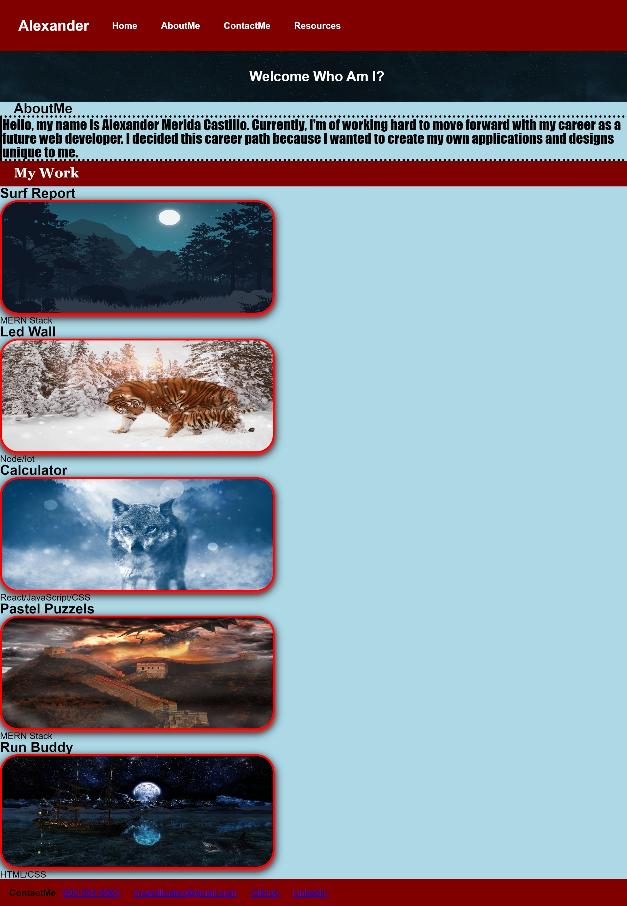

# My_Web_Portfolio
#Description
-A web page about me and future work I create.

I created this portfolio to be future placeholder for any work I make in the bootcamp program. I used html and css styling to make this webpage. I learned the purppose of using links, images, border-styling, box-shadow, display-flex, hover, etc. There are multiple ways to use css elements to do the same thing. For example, display and flex-box can produce a similar result with placing elements left, right, center, flex, inline, or row. 

#Mock_Up

#Usage

CSS adds one way of styling webpages. Html is the basic structure of any application. As a developer this can be used universally later in our careers. A portfolio is a great way for future employers or partners to see what projects I have created to give an idea of what I can do. 

#Credits

Deploy- ![alt MyWebPortfolio]./assets/images/MyWebPortfolio.jpeg/

Github_Deploy-"https://ameridacas.github.io/My_Web_Portfolio/"

Github_Repo-"https://github.com/ameridacas/My_Web_Portfolio"